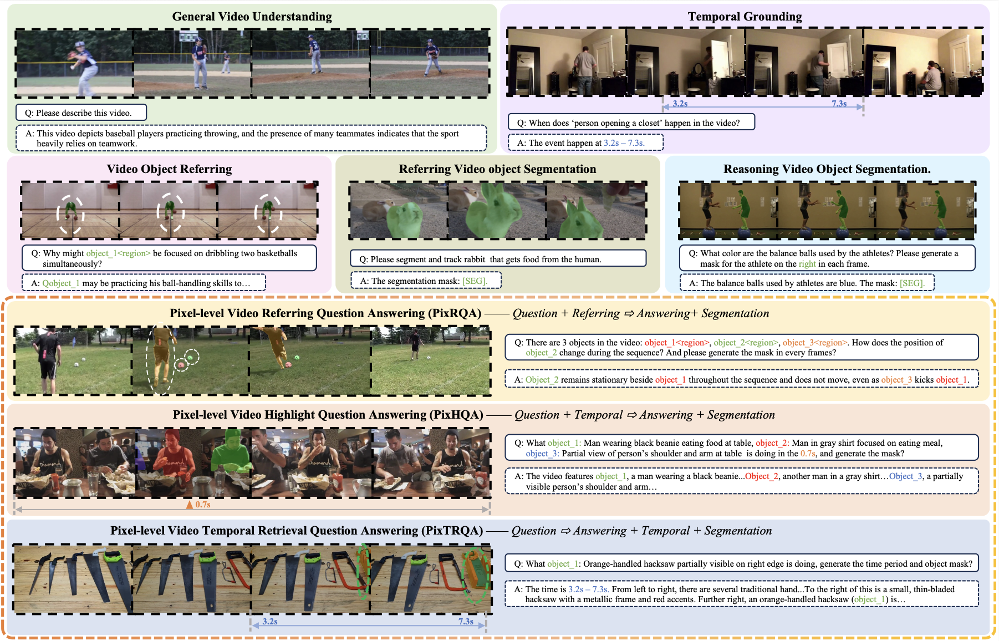
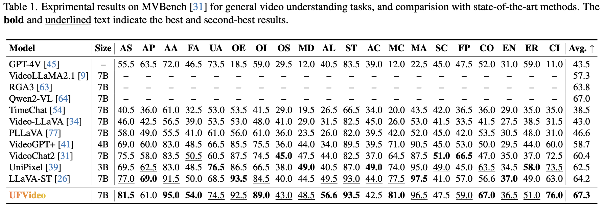
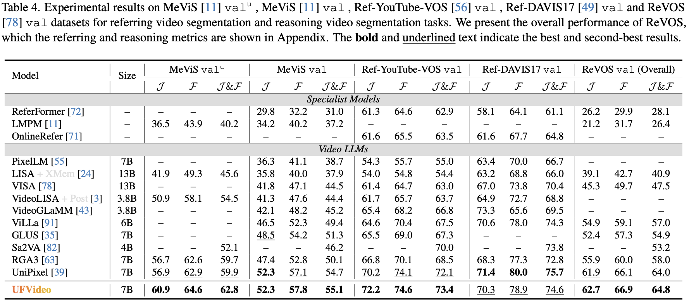

<p align="center">
  
</p>

<h2 align="center">UFVideo: Towards Unified Fine-Grained Video Cooperative Understanding with Large Language Models</h2>

<p align="center">
  <a href="https://scholar.google.com.hk/citations?user=f-tS_FwAAAAJ&hl=zh-CN">Hewen Pan</a><sup>1,2</sup>, Cong Wei<sup>2</sup>, Dashuang Liang<sup>2*</sup>, Zepeng Huang<sup>2</sup>, Pengfei Gao<sup>2</sup> <br/>  <a href="https://scholar.google.com/citations?user=4oXBp9UAAAAJ">Ziqi Zhou</a><sup>2</sup>, Lulu Xue<sup>1</sup>, Pengfei Yan<sup>1</sup>, <a href="https://scholar.google.com.hk/citations?user=JXV5yrZxj5MC&hl=zh-CN&oi=ao">Xiaoming Wei</a><sup>1</sup>, <a href="https://scholar.google.com.hk/citations?hl=zh-CN&user=j_y67gEAAAAJ">Minghui Li</a><sup>1</sup>, <a href="https://scholar.google.com.hk/citations?hl=zh-CN&user=lkAFwJgAAAAJ">Shengshan Hu</a><sup>1*</sup>
  <p align="center"><sup>1</sup>Huazhong University of Science and Technology  <br/>
    <sup>2</sup>Meituan<br/>
</p>

-----

<p align="center">
  <a href="https://arxiv.org/abs/2512.11336" target="_blank"></a>
  <a href="https://huggingface.co/Hevven/UFVideo-7B" target="_blank"></a>
  <a href="https://huggingface.co/datasets/Hevven/UFVideo-Bench" target="_blank"></a> 
</p>

<p align="justify">
This repository provides the complete code and datasets for UFVideo, a Video LLM that flexibly unifies general question answering, video object referring, video segmentation, and temporal video grounding to achieve multi-grained video understanding. It also comes with a novel video cooperative understanding benchmark, UFVideo-Bench, which includes three tasks: PixRQA (integrating general QA, video object referring, and video segmentation), as well as PixHQA and PixTRQA (joint general QA, video object referring, video segmentation and temporal video grounding).
</p>

<p align="center"></p>

## 📰 News
* **[2025.12.12]**  🔥We release [UFVideo](ufvideo/), including [UFVideo-7B](https://huggingface.co/Hevven/UFVideo-7B) model, the code of UFVideo and the [UFVideo-Bench](https://huggingface.co/datasets/Hevven/UFVideo-Bench).

## 🚀 Performance
<strong>UFVideo</strong> is the first video LLM with global-level, pixel-level and temporal-level video understanding capacity and demonstartes high performance across global and various fine-grained video understanding benchmarks.
### General Question Answering
<p align="center"></p>

### Temporal Video Grounding
<p align="center"></p>

### Video Object Referring
<p align="center"></p>

### Video Segmentation
<p align="center"></p>

## 📊 UFVideo-Bench
For evaluation, the datasets and json file of the benchmark can be accessed on [UFVideo-Bench](https://huggingface.co/datasets/Hevven/UFVideo-Bench). The usage can refer to the [PixRQA](/ufvideo/eval/inference_PixRQA.py), [PixHQA](/ufvideo/eval/inference_PixHQA.py) and [PixTRQA](/ufvideo/eval/inference_PixTRQA.py)

## 📦 UFVideo Training Dataset
Given that our training JSON files are still under compilation, we first collated and released details of the training data sources and usage methods. Below is <strong>a summary of all adopted training data sources</strong> and corresponding processing operations. We hope this dataset can provide valuable insights and support for future researchers, and <strong>we will release the finalized training JSON files as soon as possible! </strong>

| Datasets                       |Type| Download Links                                             | Notes |
|--------------------------------|----|------------------------------------------------------------| ----- |
|ST-Align-Dataset|General QA|[ST-Align-Dataset](https://huggingface.co/datasets/appletea2333/ST-Align-Dataset)|We adopt the data of the Conversation, VideoQA, Classification, and Video Captioning modules in Stage 3 of LLaVA-ST|
|LLaVA-Video-178K|General QA|[LLaVA-Video-178K](https://huggingface.co/datasets/lmms-lab/LLaVA-Video-178K)|To enhance the Multi-choice and Open-ended QA capabilities, we randomly selected 100,000 entries from the 960,792 open-ended QA items in the LLaVA-Video-178K dataset, and utilized the full set of 196,198 multiple-choice QA items.|
|VideoRefer-700K|Video Object Referring|[VideoRefer-700K](https://huggingface.co/datasets/DAMO-NLP-SG/VideoRefer-700K)|For the single-frame mode data, we used the full set of 125K object-level detailed descriptions and randomly selected 50K object-level short descriptions. For the multi-frame mode data, we adopted the complete 75K object-level QA entries and converted 125K object-level detailed descriptions into QA tasks. This setup for the VideoRefer-700K dataset follows the Stage 3 configuration specified in Appendix B of the VideoRefer paper: employ a balanced approach using half in single-frame mode and half in multi-frame mode.|
|MeVIS|Video Segmentation|[MeVIS](https://github.com/henghuiding/MeViS)|---|
|Ref-YouTube|Video Segmentation|[Ref_YouTube](https://youtube-vos.org/dataset/rvos/)|---|
|DAVIS17|Video Segmentation|[DAVIS17](https://davischallenge.org/davis2017/code.html)|---|
|ReVOS|Video Segmentation|[ReVOS](https://github.com/cilinyan/ReVOS-api)|---|
|ST-Align-Dataset|Temporal Video Grounding|[ST-Align-Dataset](https://huggingface.co/datasets/appletea2333/ST-Align-Dataset)|We adopted the TVG, DVC and TR data from Stage 2 and Stage 3 of the ST-Align-Dataset, then converted the data into relative values ranging from 0 to 99 and populated them into the conversation module.|
|internvid-tg|Temporal Video Grounding|[internvid-tg](https://huggingface.co/datasets/yingsen/internvid-tg)|The conversion method is the same as ST-Align-Dataset.|

## 📥 Installation
### Environment
First, clone the repository and navigate to the project folder.
```bash
git clone https://github.com/Heven-Pan/UFVideo
cd UFVideo
```
Then, install the requirement packages.
```bash
conda create -n UFVideo python=3.10.14
conda activate UFVideo

# our cuda version is 'cu124'
pip install -r requirements.txt
# other versions have no been verified
pip install flash-attn --no-build-isolation
```


## 🎰 Inference
Run `inference/inference_all.sh` to automatically inference finegrained spatial temporal understanding benchmarks on all available gpus, including:
* General QA: MVBench
* Video Object Referring: VideoRefer-Bench-D and VideoRefer-Bench-Q
* Video Segmentation: MeVIS val, MeVIS val u, RefYouTube, RefDAVIS and ReVOS
* Temporal Video Grounding: Charades-STA
* Multi-grained Video Cooperative Understanding: UFVideo-Bench
```bash
bash scripts/eval/eval_video_xxx.sh  # xxx refers to the detail file name
```
Parameter settings:
* `MODEL_PATH`: model path (both for full parameters or lora)
* `JSON_PATH` : path to load benchmark json data
* `DATA_PATH` : path to load benchmark video data
* `SAVE_PATH` : path to save evaluation results

## 🏋️ Training
Please check the scripts under scripts/train and set the training hyperparameters. Our experiments were conducted on a total of 32 NVIDIA A100 (80G) GPUs, stage 1 used all 32 GPUs and stage 2 used 24 GPUs (due to multi-node communication overhead). You may modify nproc_per_node, per_device_train_batch_size, and gradient_accumulation_steps to keep the same global batch size (512 for stage 1, 384 for stage 2) if you have different device configurations.
```bash
sh scripts/train/stage1.sh
sh scripts/train/stage2.sh
```

## 📑 Citation
Please kindly cite our paper if you find this project helpful.
```bibtex
@article{pan2025ufvideo,
  title={UFVideo: Towards Unified Fine-Grained Video Cooperative Understanding with Large Language Models},
  author={Pan, Hewen and Wei, Cong and Liang, Dashuang and Huang, Zepeng and Gao, Pengfei and Zhou, Ziqi and Xue, Lulu and Yan, Pengfei and Wei, Xiaoming and Li, Minghui and others},
  journal={arXiv preprint arXiv:2512.11336},
  year={2025}
}
```

## 🙏 Acknowledgement
Thanks for remarkable and impressive works [VideoRefer](https://github.com/alibaba-damo-academy/PixelRefer), [LLaVA-ST](https://github.com/appletea233/LLaVA-ST), [UniPixel](https://github.com/PolyU-ChenLab/UniPixel) and [RGA3](https://github.com/qirui-chen/RGA3-release). Our code is based on them.
